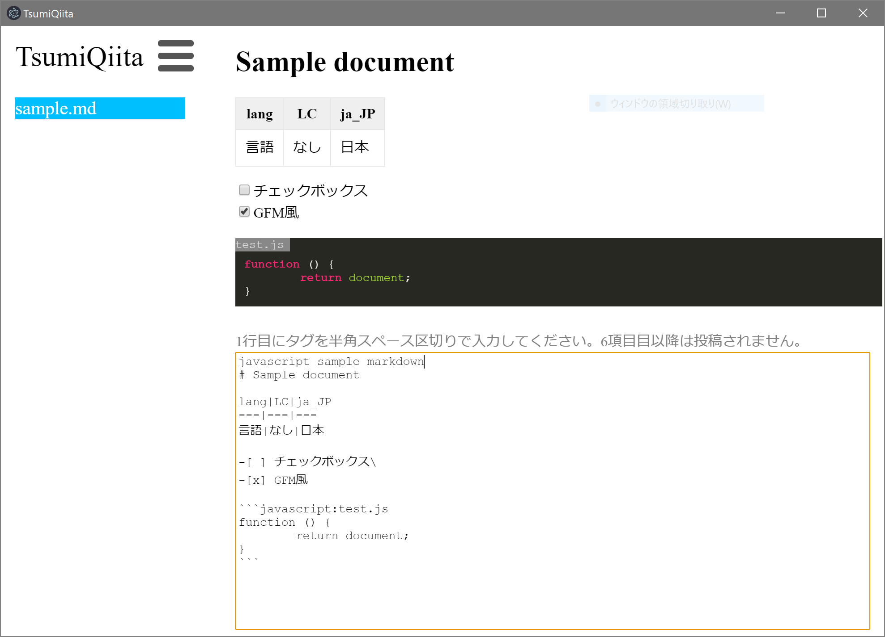

# TsumiQiitaとは

MarkdownファイルをQiitaに投稿するelectron製デスクトップアプリです。\
下書きに入りきらない**積みQiita**をするためにご利用ください。

node.jsでビルドします。<wbr>**インストール方法は[INSTALL.md](INSTALL.md)**<wbr>を参照してください。

ビルド済みは[**こちら**](https://github.com/hidao80/TsumiQiita/releases)

## 主な機能

- 選択したファイルをQiitaに限定公開として投稿
- 選択したMarkdownファイルをプレビュー
- PCのストレージから任意のMarkdownファイルを開く
- 新規Markdownファイルの作成
- Markdownで編集
- リアルタイムプレビュー
- 最後に編集してから3秒後に自動保存
- タグをつけて投稿
- 同一フォルダ内の Markdown ファイルをリストにして常時表示
- Windows / macOS / Linux でほぼ同一の UI を提供

以上の機能により、<wbr>**限定公開の草案をローカルに際限なく貯めることを可能にします**<wbr>。

### ユースケース

1. クラウドストレージにMarkdownファイルを保存し、任意の端末から編集して置いて本アプリで投稿する。
1. リアルタイムプレビューを見ながら下書きをする。

## 注意

プレビューはQiitaやGitHubでの表示と異なります。あくまで参考程度とご理解ください。

### 動作検証済み環境

- Win10 Version 1709, 1803
- macOS 10.13
- Ubuntu 18.04

### TODO

- [ ] 同期スクロールでプレビューが一番下まで表示されない
- [x] ~~対象フォルダ選択~~
- [x] ~~Markdownファイル選択~~
- [x] ~~Markdownファイルプレビュー~~
- [x] ~~プレビュー中のファイルをQiitaへ限定公開として投稿する~~
- [x] ~~編集~~
- [x] ~~新ファイル作成~~
- [ ] Qiita CSS 適用
- [x] ~~最後に編集してから3秒後に自動保存する~~
- [x] ~~タグを登録できる~~
- [x] ~~シンタックスハイライトに対応~~
- [x] ~~CommonMarkdown に作表と打ち消し線、チェックボックス表示機能を追加~~
- [x] ~~Qiita風のコードブロック（ファイル名表示機能付）~~